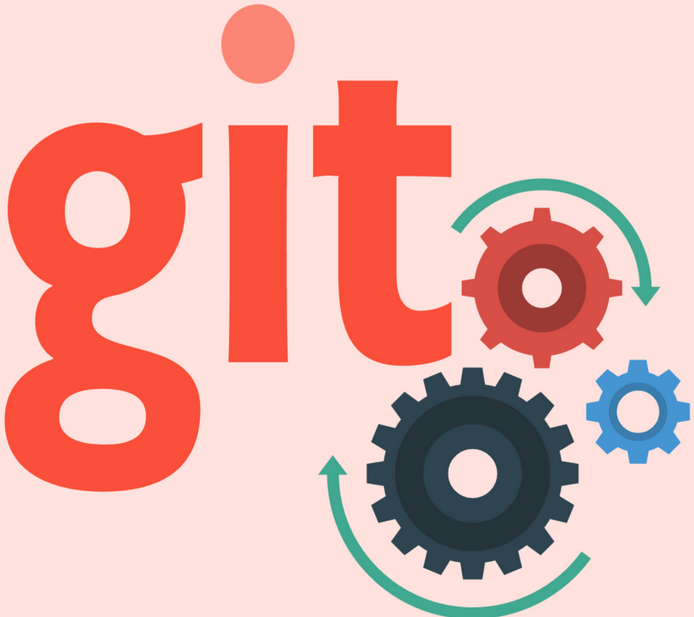
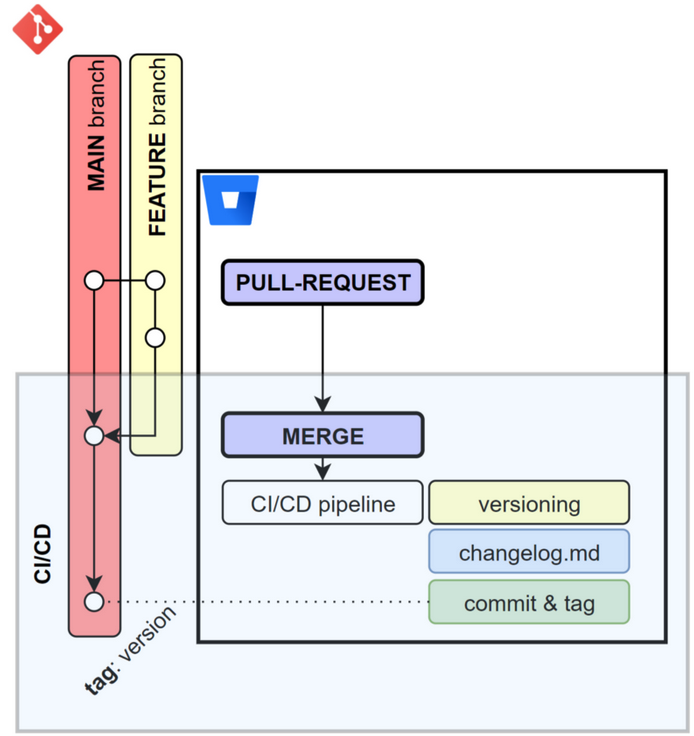
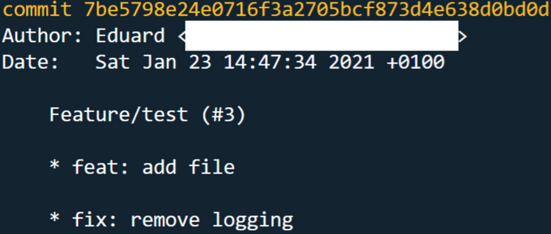

## TLDR

Don't have time to read the article 🙂 ? Check out this [repository](https://github.com/EduardBargues/content-automate-devops-with-conventional-commits) and you will find a completely functional node script that you can use to version and generate release notes automatically after each merge on your main branch. The script is a simplification of the one we use in my company for continuous integration and it is meant to work on bitbucket or Github.

## Introduction

Still here 😄? Okay, let's have a look at this script 😁❗

Since the start of 2020, I've been involved in a project to create a whole new RESTful API using Bitbucket as our version control tool. Since the beginning, my team and I have been obsessed with continuous integration so we decided that on each merge on the main branch, we would generate a new version and release notes in the same repository.

To do so, inside our repositories we have a version.json file that contains the semantic version in which our code is and a CHANGELOG.md file where we store the release notes every time a new version is generated. We decided to use [conventional-commits](https://www.conventionalcommits.org/en/v1.0.0/) to prefix our commits messages.

Wow! I just mentioned too many concepts in a single sentence 😁. Let's step back for a moment and try to get some definitions:

- Semantic version: The concatenation of 3 numbers (M.m.p) separated by dots that define the current state of your code with respect to the previous version.
  - M is called Major, and informs about the breaking changes that your code has.
  - m is called minor and informs about the new features your code has.
  - p is called patch and tells us about the bug fixes your code has.
- CHANGELOG.md: This is a file that most open-source projects have to keep track of everything that is being done in the project. Take a look at this [project](https://github.com/olivierlacan/keep-a-changelog/blob/master/CHANGELOG.md) for example.
- [Conventional-commits](https://www.conventionalcommits.org/en/v1.0.0/): I could do a complete article about them but people that know much more than me already did it 😂. The only thing you need to know is that if you prefix your commit messages with keywords, you can enrich them with extra information. Examples of commit messages that follow conventional-commits are
  - "feat: I develop an important feature"
  - "fix: I saved the day!"
  - "break: endpoint deprecated"

The last one is not 100% complaint with conventional-commits but we twisted a little bit so we had to write less in our commits 😅.

## Let's grab the ingredients



Our goal is to generate a pipeline that will be triggered after each merge from a pull request to the main branch. This pipeline will read the last merge commit and extract the semantic information from it. Here you have a commit that resulted from a merge from a pull request.



After a pull request is merged, the commits are all squashed in the merge commit and prefixed with a \* symbol. As you can see from the screenshot, we can extract:

- Author: First line of the merge commit.
- Date: Second line of the merge commit.
- Information about the work done in the pull request. Note that every commit coming from that pull request is prefixed with the \* symbol and they are following conventional-commits.

With that in mind, we can code a simple node.js script that parses all the information from that merge commit. The actions to perform are:

- Get the current date to print it in the CHANGELOG.md file.

```js
newVersion.date = new Date(); // THAT WAS EASY :) ...
```

- Get the main branch name:

```js
newVersion.branch = child
  .execSync(`git status`)
  .toString("utf-8")
  .split("\n")[0]
  .replace("On branch ", "")
  .trim();
```

- Split last merge commit into lines:

```js
const lines = child
  .execSync("git log -1 --format=full")
  .toString("utf-8")
  .split("\n");
```

- Extract the merge commit sha:

```js
newVersion.commit = lines[0].split(" ")[1];
```

- Obtain the author of the pull request:

```js
newVersion.author = lines[1].replace("Author: ", "").trim();
```

- Deduce the changes (features, fixed and breaking changes) done in the pull request:

```js
newVersion.changes = getChanges(lines);
```

- Create a new version based on those changes:

```js
let previousVersion = "0.0.0.0";
if (fs.existsSync(versionFile)) {
  previousVersion = JSON.parse(fs.readFileSync(versionFile));
}
newVersion.version = getUpdatedVersion(previousVersion, newVersion.changes);
```

- Update version.json file:

```js
fs.writeFileSync(
  versionFile,
  JSON.stringify(
    {
      current: newVersion.version,
    },
    null,
    4
  )
);
```

- Update CHANGELOG.md file:

```js
updateChangelogFile(newVersion);
```

- Commit those updates:

```js
child.execSync(`git add ${versionFile}`);
child.execSync(`git add ${changelogFile}`);
child.execSync(
  `git commit -m "[SKIP CI] Bump to version ${newVersion.version}"`
);
```

- Tag the new commit with the version and push it to the repository:

```js
child.execSync(
  `git tag -a -m "Tag for version ${newVersion.version}" ${newVersion.version}`
);
child.execSync(`git push --follow-tags`);
```

You can find the whole script [here](https://github.com/EduardBargues/content-automate-devops-with-conventional-commits/blob/main/generate-version-and-release-notes.js).

## Conclusions

We've seen a (simplified) approach that allows my team and me to extract semantic information from the merge commit once a pull request is merged. The requirements to make this script work are:

- Your commits must follow [conventional-commits](https://www.conventionalcommits.org/en/v1.0.0/).
- The merge strategy configured in your repository must be squash-and-merge. That way, all the commits in the pull request will be stored in the merge commit message.
- Define a pipeline that will trigger the generate-version-and-release-notes.js script after a (merge) commit is created in your main branch.

If you do it right (and with some adjustments based on your configuration) you should be able to have a nice continuous-integration flow.

I try to make this article as smooth as possible but I realize we covered a lot. Hopefully, the main idea was clear and any doubts you may have I'll be more than happy to answer them 😊.

Happy coding!
