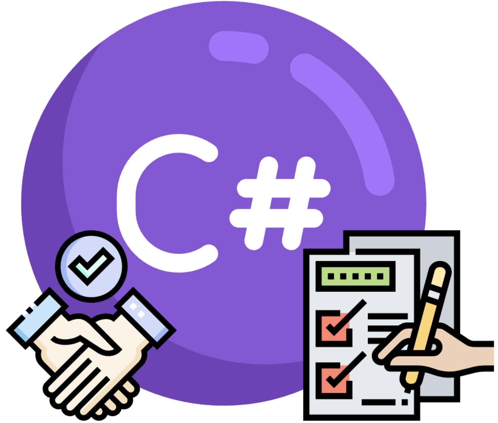
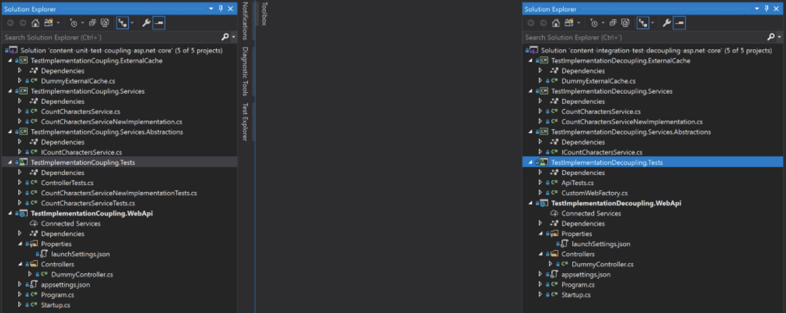
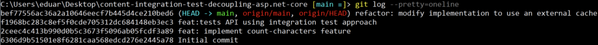

## TLDR

If you are in a hurry, take a look at those two repositories. You'll find a detailed comparison between the same service tested using two different strategies.

- [Coupling your tests with your implementation](https://github.com/EduardBargues/content-unit-test-coupling-asp.net-core).
- [Decoupling your tests from your implementation](https://github.com/EduardBargues/content-integration-test-decoupling-asp.net-core).

If you have five minutes, let's take a look in detail 😃❗

## Introduction

Since almost the start of my career, I've been involved in the development of REST APIs using Asp.Net core. It is a great framework that uses c# and provides many awesome tools. I encourage you to consider it if you are thinking to develop some APIs.

But we are not here to talk about Asp.Net core or c# (although I'll use it in the following examples). We are here to discuss a testing strategy that will allow you to:

- Implement fewer tests,
- Test your API like your client would and
- Reduce the maintenance cost of your tests by decoupling them from your code implementation.

Both repositories are developed using Asp.Net core with c#. Here you have a picture of both solutions in visual studio.

You can see they contain the same implementation and structure:

- WebApi: Exposes in both cases a dummy controller with a single endpoint. This endpoint receives a word in the URL and returns the number of characters this word contains. If you run one of the solutions and type the endpoint local address in your browser you'll obtain something like this:

- Services: The controller consumes an internal service using dependency injection that implements the interface `ICountCharactersService`. This service is registered in the Startup.cs class and returns the number of characters of a provided word.

- Git story: If you go to your terminal (in any of the folders where you cloned the repositories) and type `git log --oneline` you should see something like the following screenshot. Omitting the Initial commit, there are three commits:
  - implement the actual service,
  - implement the tests,
  - and change the service implementation to use an internal cache.

## Test strategy

At this point, I encourage you to open both solutions (.sln files) and take a look at each test project: they both end with the Tests suffix.

In the case of the unit-test approach, every single class in the service is tested in an isolated way while mocking its dependencies. There are three tests classes that test the following scenarios:

- ControllerTests: one single test checking that what is received from the service is passed to the client.
- CountCharactersServiceTests: Three tests checking the correct behavior of the service when the provided word is null, empty, and four letters long.
- CountCharactersServiceNewImplementationTests: Five tests that ensure the correct behavior of the service when the word is null, the word is empty and is not cached, the word is empty and is cached, the word is four letters long and is not cached, and, lastly, the word is four letters long and is cached.

In total, we are dealing with 9 tests that need to be maintained 😐 for such a simple service.

On the other side, we have the component-test approach. If you check the solution, you can see that in this case, we are only managing a single test class called ApiTests.cs. Here we can find three simple tests that check the correct behavior on any request a client could make. That is much more maintainable 😊❗

## Conclusion

We've seen the comparison of using a unit-test strategy vs. an component-test strategy when developing an API.

The component-test strategy has proven to be more efficient since allowed us to:

- Cover ALL the possible scenarios from our API-clients perspective,
- Reduce the number of tests that we need to maintain,
- and Make them independent from the API implementation.

When testing, it is essential to realize the added value vs. the maintenance cost of a test. Before implementing a test, ask yourself 'Is this test covering a flow our API-users could do?'. If the answer is no, then there is no added value and the test would only bring you maintenance cost in the immediate future.

Happy coding 😊❗
