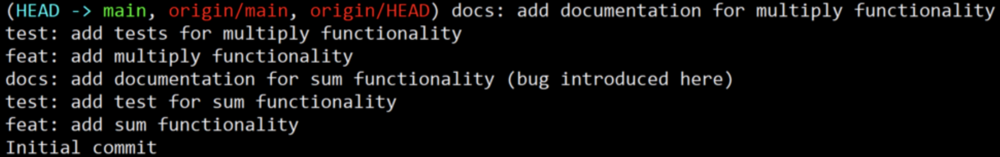
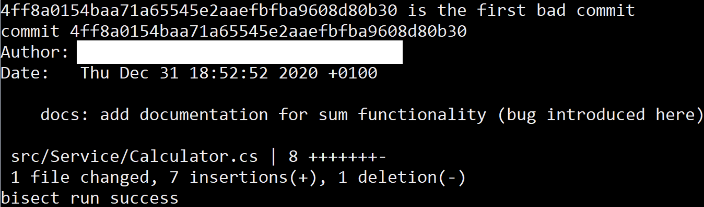

## Introduction

Not long ago, I was asked by one of my product owners (PO) to solve a bug one of our clients encountered. The content of the bug is not relevant but the PO asked me a series of questions (all of them quite reasonable 🙂):

- Is it something we introduced our selves or is it something our platform doesn't support?
- When did we introduce this bug?
- Who did it?
- Can you solve it? (That's the obvious one 😜, dah …)

Well, at that moment, I was quite new to the company, and my experience in the code-base was minimal. Also, the whole company was immersed in a difficult deployment so I could not find support from my colleagues. So, … What did I do?

## Solve the problem

For the sake of this example, let's suppose that the service we are dealing with is a very simple calculator. You can find the code [here](https://github.com/EduardBargues/content-find-the-hidden-bug-with-git-bisect).

As you can see, the service exposes 2 features: Sum (yeap, … if your eyes were fast enough, you realized that the bug is here 😁) and Multiply.

If you clone the repository and type `git log --oneline` in your command line you will see something like this (Note that the fourth commit introduced the bug):



Before trying to find the bug, let's have a little brainstorming. How are we going to answer all those questions? We need to know when and where the bug was introduced and by whom was introduced. To search for the bug we basically need to perform a binary search in the previous list of commits.

- We will check out the last commit and ensure the bug is there.
- Then, we will check out the first commit and ensure the bug is not there.
- Finally, we will check out the commit in the middle and check if the bug is there or not.
- The process will continue until there is only one commit left and that one is going to be the first commit where the bug was introduced. So, let's do it 😊!

But wait 😯! Are we going to do that manually? What if we have hundreds of commits? That doesn't seem a good approach. Fortunately for us, git-bisect has an option to perform this binary search automatically. The only thing it requires is a test it can check against and a couple of commits ids.

But damn it! Another problem 😟... We don't have a test. In fact, if we had it, the bug would have already been detected and solved, dah! 😝 To solve that, we are going to introduce a test that will allow us to check the bug, we will ensure it fails in the last commit, and (magically) we will make it travel along the commit history until the bug is found.

Add a file called TestToFindTheBug.cs with the following content in the project Tests.

```csharp
public class TestToFindTheBug
{
    [Fact]
    public void LetsFindTheBug()
    {
        var calculator = new Calculator();
        var result = calculator.Sum(1, 2);
        Assert.Equal(3, result);
    }
}
```

Add TestToFindTheBug.cs to your .gitignore file in a new line (⚠️Attention! This will allow your test to travel through your commit history) and commit both changes to your repository using

```bash
git add .
git commit -m "commit to find the bug"
```

And now the magic starts 😊! Type the following commands to start git-bisect. In my case was:

```bash
git bisect start
git bisect bad
git bisect good 514a452691edeaee32aceaa1f2e438d3ae447c6c
git bisect run dotnet test src/content-find-the-hidden-bug-with-git-bisect.sln
```

Which let git find out the commit and provide the final output:



Note that:

- `git bisect bad` tells git that the current commit contains the bug.
- `git bisect good 514a452691edeaee32aceaa1f2e438d3ae447c6c` tells git that that commit does not contain the bug.
- `git bisect run dotnet test src/content-find-the-hidden-bug-with-git-bisect.sln` tells git to run the donet tests on each iteration of the binary search.

## Conclusions

Git bisect has an automatic way of finding bugs using `git bisect start`, `git bisect bad <current commit>`, `git bisect good <first-okay-commit>` and `git bisect run <script-to-test>`.

In the problem I posted at the beginning, git didn't find any first commit without the bug which means the client found a new feature that was never implemented 🙂. The PO was happy to schedule the new feature for the next sprint.

Whenever you face questions from your PO, always try to answer in terms of the product-language. To do so, use the best tool you can and I hope git-bisect could become one of those tools.

HAPPY CODING!
